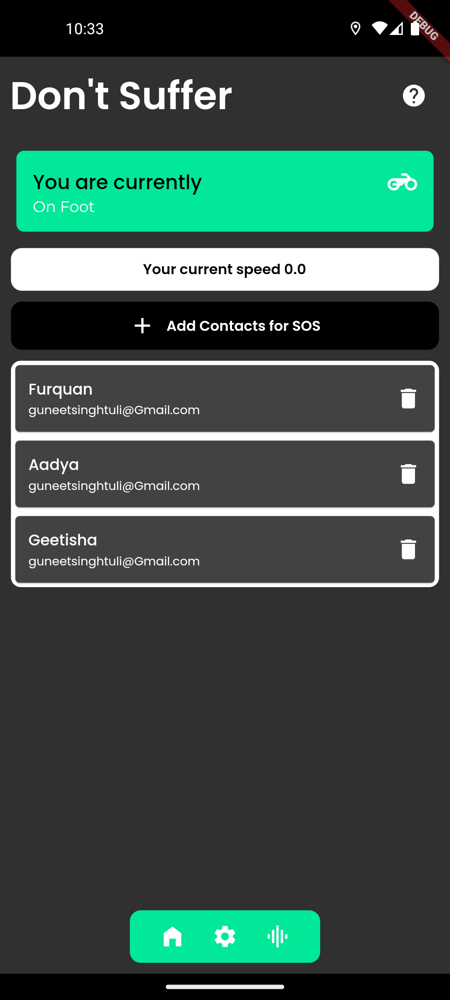

# supabase_hack

Submission for Supabase_hack

# Accident Detection


This is an app for detecting road accidents using machine learning techniques. This app use a variety of sensors, such as accelerometers and GPS to detect and analyze data related to accidents, such as changes in speed, direction, and impact force. The ultimate goal is to minimize response times and improve outcomes for those involved in accidents. The key challenges in developing effective accident detection systems include ensuring accuracy and reliability of detection, minimizing false positives, and ensuring compatibility with existing emergency response infrastructure.

## Use of Supabase

I implemented Supabase's magic link authentication, simplifying the login process and enhancing the user experience. The SOS list was securely stored in a dedicated table within the Supabase database, allowing efficient management of SOS requests. Supabase's seamless integration and robust features provided a reliable backend infrastructure for my project.

## Video Links

Before Accident: https://drive.google.com/file/d/15a0tmAD_j63vGzN-7_K--lwiejBV5Si1/view?usp=sharing

At time of accident: https://drive.google.com/file/d/15ref3lGqpElTICW8uh1KY-P5ashAo1ZW/view?usp=sharing

## PDF Link

[//]: # (SHow Woo.pdf here)
[Don't miss this out](./WOO.pdf)


## Home Page in Dark Mode 




## Participants 

Twitter: https://twitter.com/Guneetsingh02
Github: https://github.com/Guneetsinghtuli


## Features
Accelerometer and Gyroscope sensors: The app uses the accelerometer and gyroscope sensors in a mobile device to detect sudden changes in speed or direction that may indicate a car accident.

SOS: If a car accident is detected, the app automatically sends an emergency alert to pre-configured emergency contacts with the user's location information and a message indicating that an accident has occurred.

## Installation

To run this project, you need to have the following software installed:


Flutter SDK

Android Studio

TensorFlow 2.0 or higher


## Getting Started

To get started with this project, you will need to have the Flutter SDK installed on your machine. You can download the SDK and follow the installation instructions from the Flutter website.

After you have installed the Flutter SDK, you can clone this repository:

```bash
git clone https://github.com/Guneetsinghtuli/supabase
```

Then, you can run the app on an Android or iOS device using the following command:

```
flutter run
```


For help getting started with Flutter development, view the
[online documentation](https://docs.flutter.dev/), which offers tutorials,
samples, guidance on mobile development, and a full API reference.
